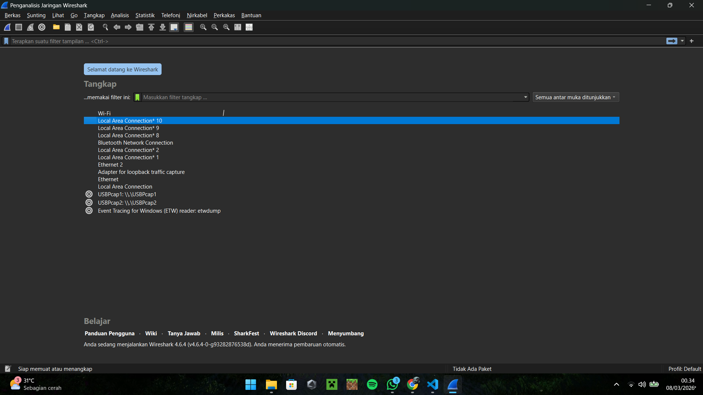

# Laporan Praktikum Jarkom IF-04-04

# Tujuan Praktikum
Mempelajari cara menginstalasi Wireshark

# Langkah Percobaan 
### Tata Cara Instalasi Wireshark

1. **Mengunduh Installer:** Buka situs web resmi Wireshark (https://www.wireshark.org) dan unduh *installer* versi terbaru yang sesuai dengan sistem operasi (misalnya, Windows x64 Installer).
2. **Menjalankan Installer:** Buka file `.exe` yang telah diunduh. Pada jendela *Welcome to Wireshark Setup*, klik **Next** untuk memulai.
3. **Persetujuan Lisensi:** Baca syarat dan ketentuan (*License Agreement*), lalu klik **Noted** untuk melanjutkan.
4. **Pemilihan Komponen dan Lokasi:** Biarkan pengaturan komponen (*Choose Components*) secara *default*. Tentukan lokasi folder instalasi (umumnya di `C:\Program Files\Wireshark`), kemudian klik **Next**.
5. **Instalasi Npcap (Sangat Penting):** Pada bagian *Packet Capture*, **pastikan opsi "Install Npcap" tercentang**. Npcap diperlukan agar Wireshark dapat menangkap lalu lintas jaringan secara langsung. Klik **Next**.
6. **Instalasi USBPcap (Opsional):** Pada bagian *USB Capture*, opsi ini bisa dibiarkan tidak tercentang jika hanya untuk memonitor jaringan lokal/internet biasa. Klik **Install**.
7. **Penyelesaian:** Tunggu hingga proses ekstraksi dan instalasi selesai. Jika muncul *pop-up* instalasi Npcap di tengah proses, ikuti instruksinya hingga *Finish*. Setelah instalasi utama selesai, klik **Next** lalu **Finish**.
8. **Verifikasi:** Buka aplikasi Wireshark yang telah terinstal untuk memastikan program berjalan dengan baik dan siap digunakan untuk menangkap paket jaringan.

# Lampiran 
Hasil Percobaan :
