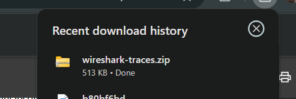
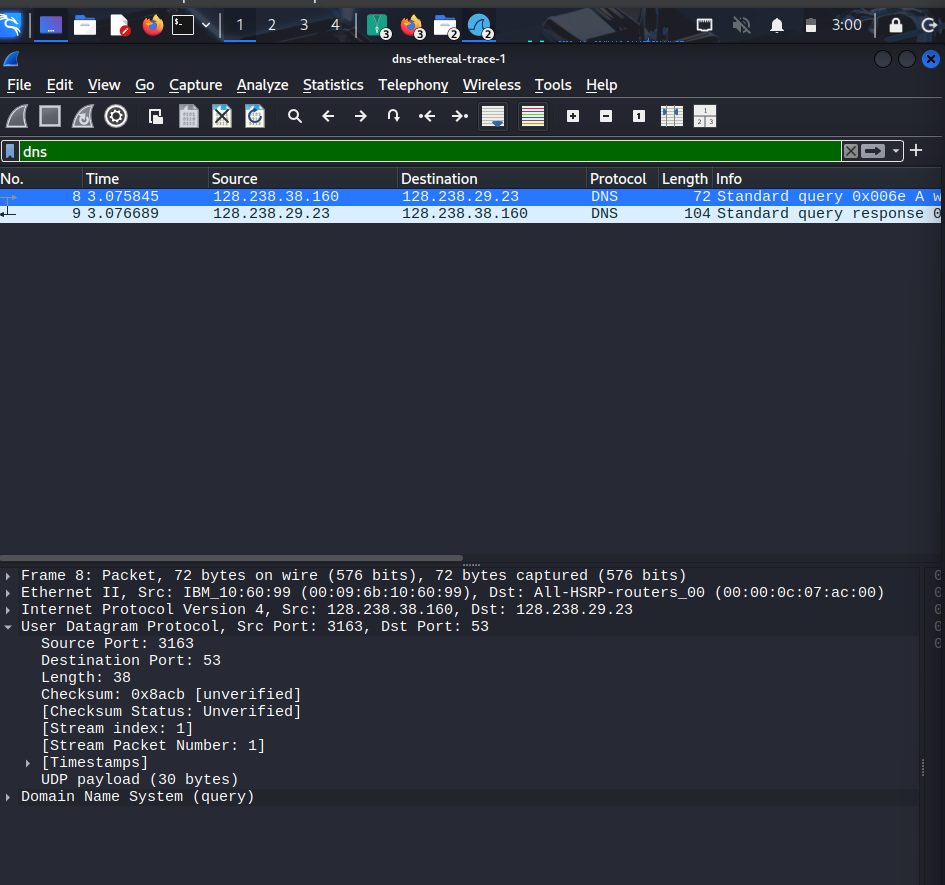
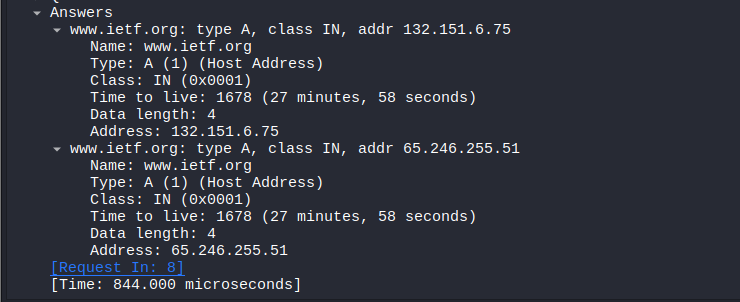

# Laporan Analisis Protokol DNS (Wireshark Trace)

### 1. Protokol Transmisi DNS
Pesan permintaan (*query*) dan balasan (*response*) DNS dikirimkan menggunakan protokol **UDP** (User Datagram Protocol).
* **Bukti:** Berdasarkan gambar  dan , pada detail paket nomor 8, kolom protokol menunjukkan UDP. Hal ini dikarenakan DNS membutuhkan kecepatan tinggi dan overhead yang rendah.

---

### 2. Port Sumber dan Tujuan
Berdasarkan analisis pada paket nomor 8 :
* **Pesan Permintaan (Query):** * Source Port: **3163**
    * Destination Port: **53**
* **Pesan Balasan (Response):** * Source Port: **53**
    * Destination Port: **3163**
* **Penjelasan:** Port 53 adalah port standar yang digunakan oleh server DNS.

---

### 3. Alamat IP Tujuan dan DNS Lokal
* **Alamat IP Tujuan (pada trace):** **128.238.29.23** .
* **Alamat IP DNS Lokal Anda:** Berdasarkan hasil `ip addr` pada `, komputer Anda memiliki alamat IP **10.0.2.15** pada interface `eth0`.
* **Analisis:** Kedua alamat IP tersebut **tidak sama**. Alamat IP di Wireshark adalah server DNS yang digunakan oleh pengunggah file trace asli, sedangkan IP lokal Anda adalah konfigurasi jaringan Anda saat ini.

---

### 4. Pemeriksaan Pesan Permintaan (DNS Query)
* **Jenis (Type):** **Type A** (Host Address).
* **Jawaban (Answers):** Pesan permintaan tersebut **tidak mengandung jawaban** (*0 answers*).
* **Bukti:** Pada , bagian `Answer RRs` menunjukkan nilai **0**. Pesan ini hanya berisi pertanyaan untuk mencari alamat IPv4 dari `www.ietf.org`.

---

### 5. Pemeriksaan Pesan Balasan (DNS Response)
* **Jumlah Jawaban:** Terdapat **2 jawaban** (*Answers*).
* **Isi Jawaban:**
    1.  `www.ietf.org`: Address **132.151.6.75**
    2.  `www.ietf.org`: Address **65.246.255.51**
* **Bukti:** Data ini terlihat pada section *Answers* di gambar `, lengkap dengan nilai TTL (*Time to Live*) sebesar 1678.

---

### 6. Verifikasi Alamat IP pada TCP SYN
* **Analisis:** Setelah resolusi DNS selesai, host mengirimkan paket **TCP SYN** (paket nomor 10) untuk memulai koneksi HTTP.
* **Hasil:** Alamat IP tujuan pada paket TCP tersebut adalah **132.151.6.75**.
* **Kesimpulan:** **Ya, sesuai.** Alamat IP tersebut cocok dengan salah satu alamat IP yang diberikan oleh server DNS dalam paket balasan sebelumnya. (Bukti: `).

---

### 7. Pengambilan Gambar dan Permintaan DNS Baru
* **Pertanyaan:** Apakah host perlu mengirimkan pesan DNS baru setiap kali mengakses gambar?
* **Jawaban:** **Tidak perlu.**
* **Penjelasan:** Berdasarkan ``, host dapat langsung melakukan permintaan HTTP GET untuk mengambil gambar (contoh: `ietflogo2e.gif`) menggunakan alamat IP yang sudah didapatkan sebelumnya. Host menggunakan **DNS Cache** untuk menyimpan informasi alamat IP dalam jangka waktu tertentu (sesuai TTL), sehingga tidak perlu melakukan query DNS berulang kali untuk objek di domain yang sama.