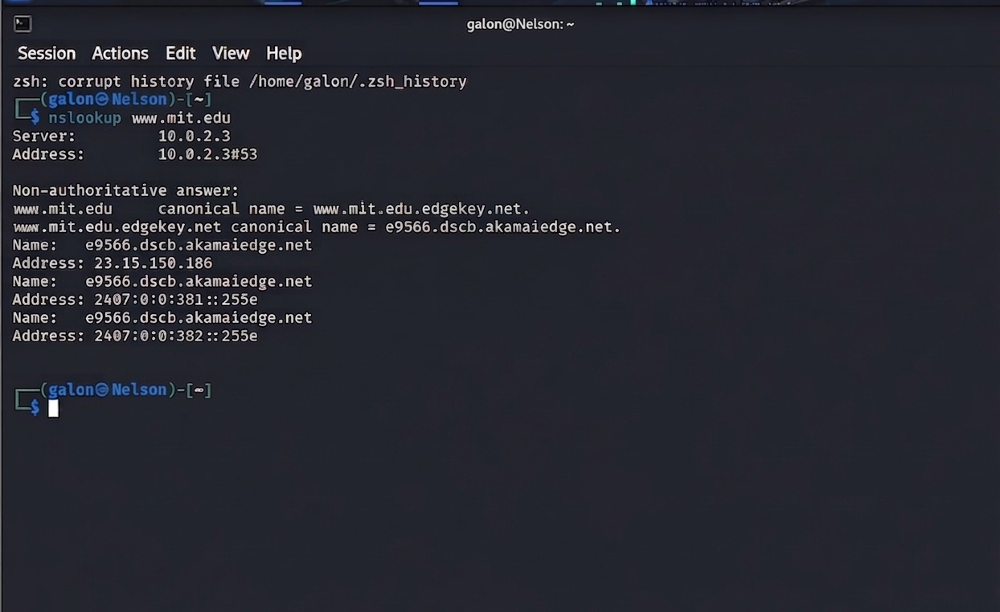
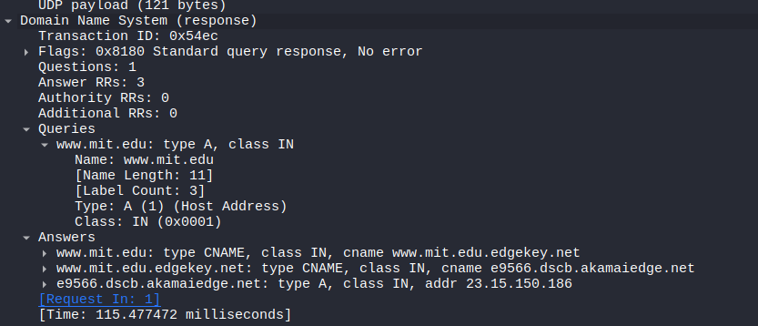

# Laporan Praktikum Jaringan Komputer: Analisis DNS dengan nslookup dan Wireshark

**Nama:** Samuel Nelson Wabiser
**Kasus:** Analisis Query DNS untuk `www.mit.edu`

---

## Jawaban Pertanyaan

### 1. Port Tujuan dan Port Sumber
* **Pesan Permintaan (DNS Query):** Berdasarkan detail paket pada gambar , **Port Tujuan (Destination Port)** adalah **53**.
* **Pesan Balasan (DNS Response):** Berdasarkan header UDP pada gambar yang sama, **Port Sumber (Source Port)** dari server DNS adalah **53**. Port ini merupakan port standar untuk protokol DNS.

### 2. Alamat IP Tujuan Pesan Permintaan
* Pesan permintaan DNS dikirim ke alamat IP **10.0.2.3** (terlihat pada kolom *Destination* di `image_9a4b69.png`).
* **Status:** Alamat IP tersebut merupakan **default alamat IP server DNS lokal** pada sistem ini. Hal ini dikonfirmasi melalui hasil perintah `nslookup` pada gambar `image_99ed70.png` yang menunjukkan `Address: 10.0.2.3#53`.

### 3. Pemeriksaan Pesan Permintaan (DNS Query)
* **Jenis (Type):** Berdasarkan gambar `image_9a4ba7.png`, jenis atau "type" dari pesan tersebut adalah **Type A (Host Address)**, yang bertujuan mencari alamat IPv4.
* **Isi Jawaban:** Pesan permintaan **tidak mengandung jawaban**. Hal ini terlihat pada gambar `image_9a47a6.png` di mana nilai **Answer RRs** adalah **0**.

### 4. Pemeriksaan Pesan Balasan (DNS Response)
Berdasarkan rincian pada gambar `image_9a4eab.png`, hasil analisisnya adalah:
* **Jumlah Jawaban (Answers):** Terdapat **3 jawaban** (Answer RRs: 3).
* **Isi Jawaban:**
    1.  **CNAME:** `www.mit.edu` adalah alias dari `www.mit.edu.edgekey.net`.
    2.  **CNAME:** `www.mit.edu.edgekey.net` adalah alias dari `e9566.dscb.akamaiedge.net`.
    3.  **Address (Type A):** `e9566.dscb.akamaiedge.net` memiliki alamat IP **23.15.150.186**.

---

## 5. Lampiran Bukti Tangkapan Layar

### A. Eksekusi nslookup pada Terminal

### B. Analisis Header IP dan UDP (Port & IP Dest)

### C. Detail Query (Type A dan Answer RRs)

### D. Detail Response (Daftar Jawaban/Answers)
