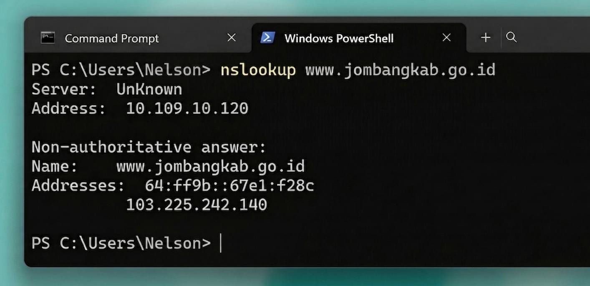
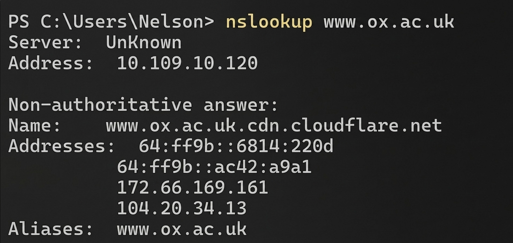
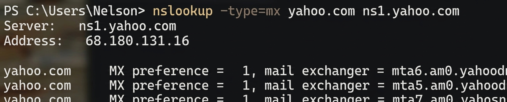

# Laporan Praktikum Jaringan Komputer - nslookup

**Nama:** Naufal Fudhail 
**Instansi:** Telkom University Surabaya  
**Tools:** Windows PowerShell / Command Prompt (`nslookup`)

---

## 1. Alamat IP Server Web di Asia
**Pertanyaan:** Jalankan `nslookup` untuk mendapatkan alamat IP dari server web di Asia. Berapa alamat IP server tersebut?

**Hasil Analisis:**
Berdasarkan pengujian pada domain pemerintah Indonesia (`www.jombangkab.go.id`), didapatkan hasil sebagai berikut:

* **Command:** `nslookup www.jombangkab.go.id`
* **Alamat IPv4:** `103.225.242.140`
* **Alamat IPv6:** `64:ff9b::67e1:f28c`

---

## 2. Server DNS untuk Universitas di Eropa
**Pertanyaan:** Jalankan `nslookup` agar dapat mengetahui server DNS otoritatif untuk universitas di Eropa.

**Hasil Analisis:**
Pengujian dilakukan terhadap Universitas Oxford (`www.ox.ac.uk`). Hasil menunjukkan bahwa domain tersebut menggunakan layanan Cloudflare sebagai bagian dari infrastruktur distribusinya.

* **Command:** `nslookup www.ox.ac.uk`
* **Nama Alias (CNAME):** `www.ox.ac.uk.cdn.cloudflare.net`
* **Alamat IP yang Terdeteksi:** * `172.66.169.161`
    * `104.20.34.13`

---

## 3. Informasi Server Email (MX Record) Yahoo! Mail
**Pertanyaan:** Jalankan `nslookup` untuk mencari tahu informasi mengenai server email dari Yahoo! Mail melalui salah satu server yang didapatkan di pertanyaan nomor 2. Apa alamat IP-nya?

**Hasil Analisis:**
Perintah dijalankan dengan menentukan tipe query `mx` (Mail Exchanger) untuk domain `yahoo.com` menggunakan DNS server `ns1.yahoo.com`.

* **Command:** `nslookup -type=mx yahoo.com ns1.yahoo.com`
* **Server DNS yang Digunakan:** `ns1.yahoo.com`
* **Alamat IP Server DNS tersebut:** `68.180.131.16`
* **Daftar Mail Exchanger (MX):**
    1.  `mta6.am0.yahoodns.net` (Preference = 1)
    2.  `mta5.am0.yahoodns.net` (Preference = 1)
    3.  `mta7.am0.yahoodns.net` (Preference = 1)

