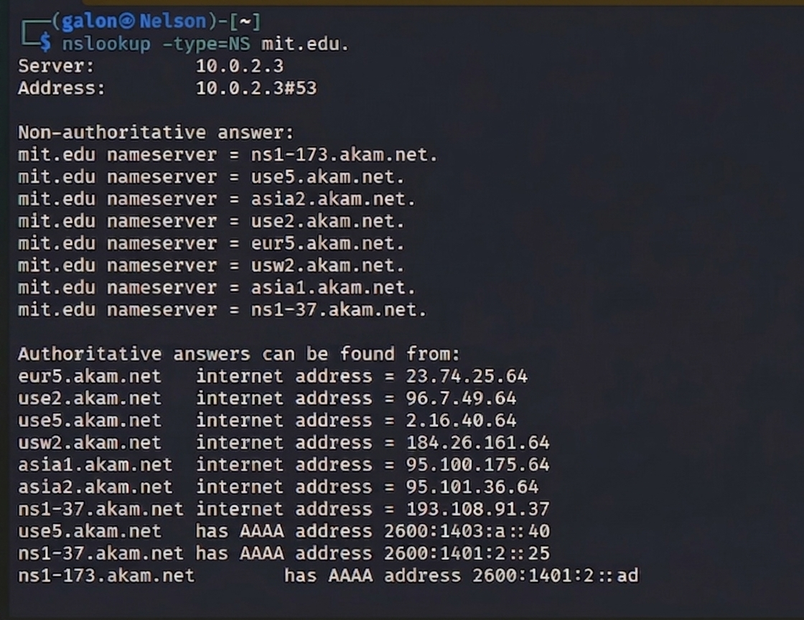
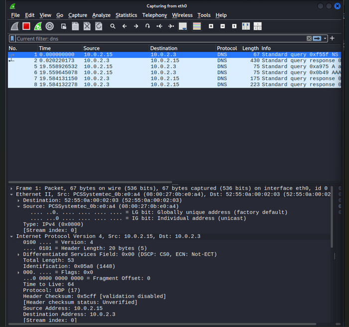
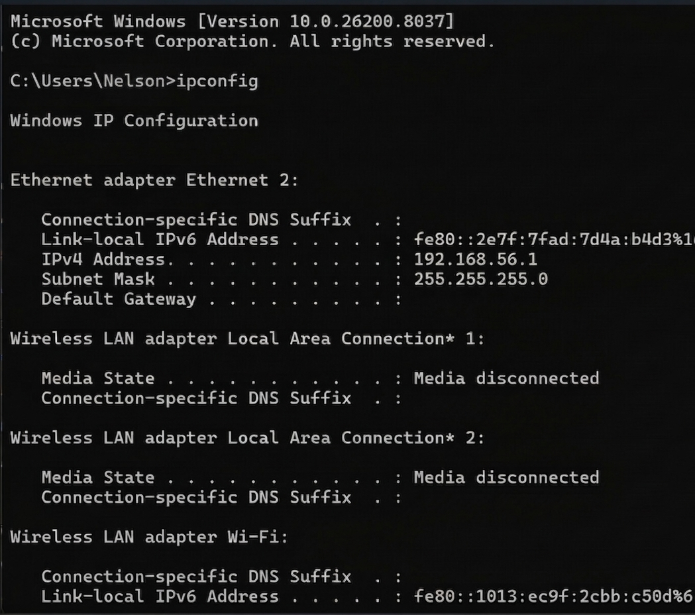
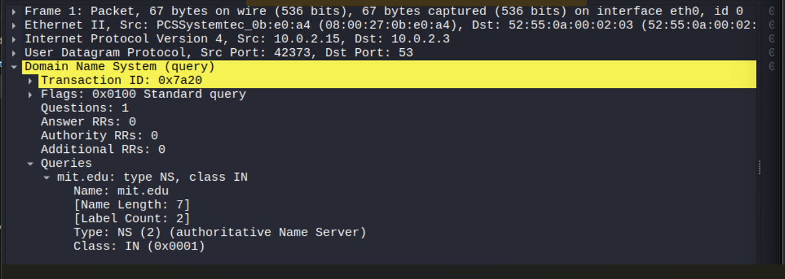
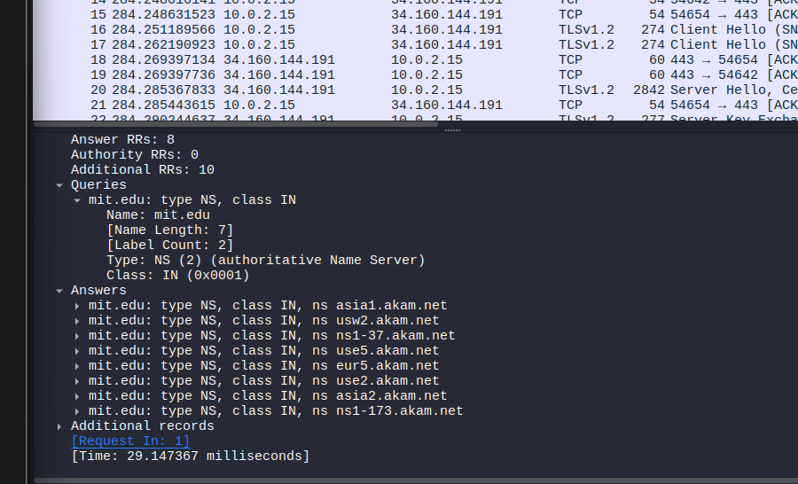

# Laporan Analisis Protokol DNS: `nslookup -type=NS mit.edu`

Berdasarkan hasil tangkapan layar (screenshot) dari terminal dan Wireshark yang dilampirkan, berikut adalah analisis detail mengenai kueri DNS tersebut:

---

## 1. Alamat IP Tujuan Permintaan DNS
* **IP Tujuan:** Pesan permintaan DNS dikirim ke alamat IP **10.0.2.3**.
    * Hal ini terlihat pada  di bagian `Address: 10.0.2.3#53`.
    * Pada  (Wireshark), terlihat paket pertama memiliki *Destination* `10.0.2.3`.
* **Default DNS Server:** **Ya**, ini adalah DNS server lokal Anda. Pada  (hasil `ipconfig`), alamat IP komputer Anda adalah `192.168.56.1`, yang berada dalam jaringan privat, dan sistem Anda dikonfigurasi untuk bertanya pada resolver lokal di `10.0.2.3`.

## 2. Pemeriksaan Pesan Permintaan (DNS Query)
Berdasarkan  yang menunjukkan detail paket kueri:
* **Jenis (Type):** Pesan tersebut bertipe **NS (Authoritative Name Server)**.
* **Kandungan "Answers":** Pesan permintaan tersebut **tidak mengandung "Answers"**.
    * Pada detail protokol terlihat: `Questions: 1`, `Answer RRs: 0`, `Authority RRs: 0`.
    * **Penjelasan:** Sebuah *query* hanya berisi pertanyaan. Jawaban hanya akan muncul pada paket *response* (balasan) dari server.

## 3. Pemeriksaan Pesan Balasan (DNS Response)
Berdasarkan `file1.png` dan detail pada `file5.png`:
* **Nama Server MIT:** Server MIT dikelola oleh layanan Akamai. Nama-nama server yang diberikan antara lain:
    * `asia1.akam.net`
    * `usw2.akam.net`
    * `ns1-37.akam.net`
    * `use5.akam.net`
    * `eur5.akam.net`
    * `use2.akam.net`
    * `asia2.akam.net`
    * `ns1-173.akam.net`
* **Alamat IP Server:** **Ya**, pesan balasan memberikan alamat IP.
    * Pada , bagian **"Authoritative answers can be found from"** mencantumkan IPv4 (Internet Address). Contoh: `eur5.akam.net` adalah `23.74.25.64`.
    * Pada , terlihat adanya **"Additional records"** sebanyak 10 buah, yang biasanya berisi alamat IP (Glue Records) agar komputer bisa langsung menghubungi Name Server tersebut.

---

## Tutorial Replikasi Percobaan
1.  **Persiapan:** Buka Wireshark dan mulai *capture* pada interface yang aktif.
2.  **Filter:** Masukkan kata kunci `dns` pada kolom filter Wireshark agar trafik lain tidak mengganggu.
3.  **Eksekusi:** Buka Terminal/CMD, ketik `nslookup -type=NS mit.edu`.
4.  **Analisis:**
    * Klik pada paket **Query** (arah keluar) untuk melihat pertanyaan Anda.
    * Klik pada paket **Response** (arah masuk) untuk melihat daftar Name Server dan alamat IP-nya di bagian *Answers* atau *Additional Records*.