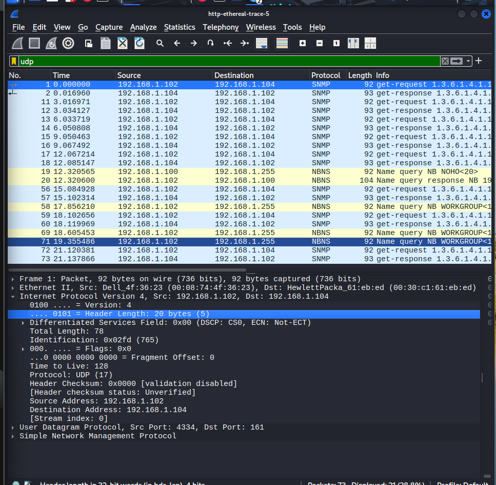

# Laporan Analisis Protokol UDP - Wireshark

**Nama:** Naufal Fudhail 
**File Analisis:** `http-ethereal-trace-5`  
**Data Paket:** Paket No. 1 (SNMP)

---

### 1. Field pada Header UDP
**Pertanyaan:** Berapa banyak “field” yang terdapat pada header UDP? Sebutkan nama-nama field yang ditemukan!

**Jawaban:**
Berdasarkan tampilan pada gambar  di bagian *User Datagram Protocol*, terdapat **4 field** utama pada header UDP, yaitu:
1.  **Source Port**
2.  **Destination Port**
3.  **Length**
4.  **Checksum**

---

### 2. Panjang Masing-masing Field (dalam Byte)
**Pertanyaan:** Berapa panjang (dalam satuan byte) masing-masing “field” yang terdapat pada header UDP?

**Jawaban:**
Dalam arsitektur TCP/IP, setiap field pada header UDP memiliki panjang tetap sebesar **2 byte** (16 bit). 
* **Source Port:** 2 byte
* **Destination Port:** 2 byte
* **Length:** 2 byte
* **Checksum:** 2 byte
* **Total Header UDP:** 8 byte

---

### 3. Makna Nilai "Length" dan Verifikasi
**Pertanyaan:** Nilai yang tertera pada ”Length” menyatakan nilai apa? Verifikasikan melalui paket UDP pada trace.

**Jawaban:**
Nilai **Length** menyatakan panjang total segmen UDP dalam satuan byte, yang merupakan hasil penjumlahan dari **Panjang Header UDP (8 byte) + Panjang Data (Payload)**.

**Verifikasi (Berdasarkan ):**
* Nilai field **Length** yang tertera: **58**
* Nilai **UDP payload** yang tertera di bawahnya: **50 bytes**
* **Perhitungan:** $8 \text{ byte (Header)} + 50 \text{ byte (Payload)} = 58 \text{ byte}$.
Hasil perhitungan ini sesuai dengan nilai yang tertera pada field Length.

---

### 4. Jumlah Maksimum Byte Payload UDP
**Pertanyaan:** Berapa jumlah maksimum byte yang dapat disertakan dalam payload UDP?

**Jawaban:**
Karena field *Length* pada header UDP terdiri dari 16 bit, maka nilai maksimum yang dapat ditampung adalah $2^{16} - 1 = 65.535$ byte. Namun, nilai ini sudah termasuk 8 byte header. Maka, jumlah maksimum byte untuk payload adalah:
$$65.535 - 8 = 65.527 \text{ byte}$$

---

### 5. Nomor Port Terbesar
**Pertanyaan:** Berapa nomor port terbesar yang dapat menjadi port sumber?

**Jawaban:**
Field *Source Port* juga memiliki panjang 16 bit. Oleh karena itu, nomor port terbesar yang dimungkinkan adalah:
$$2^{16} - 1 = 65.535$$

---

### 6. Nomor Protokol untuk UDP
**Pertanyaan:** Berapa nomor protokol untuk UDP dalam notasi heksadesimal dan desimal? (Lihat bagian Protocol pada datagram IP).

**Jawaban:**
Berdasarkan gambar  pada bagian *Internet Protocol Version 4*:
* **Notasi Desimal:** 17
* **Notasi Heksadesimal:** `0x11` (didapat dari konversi desimal 17 ke heksadesimal).

---

### 7. Analisis Pasangan Paket (Request-Response)
**Pertanyaan:** Jelaskan hubungan antara nomor port pada kedua paket (paket pengirim dan paket balasan)!

**Jawaban:**
Berdasarkan *trace* pada daftar paket di bagian atas gambar:
* **Paket 1 (Request):** Dikirim dari `192.168.1.102` ke `192.168.1.104`.
    * Source Port: **4334**
    * Destination Port: **161** (SNMP)
* **Paket 2 (Response):** Balasan dari `192.168.1.104` ke `192.168.1.102`.
    * Source Port: **161**
    * Destination Port: **4334**

**Kesimpulan Hubungan:**
Nomor port pada kedua paket tersebut saling **bertukar posisi (swapped)**. Port sumber pada paket pertama menjadi port tujuan pada paket balasan, dan port tujuan pada paket pertama menjadi port sumber pada paket balasan.